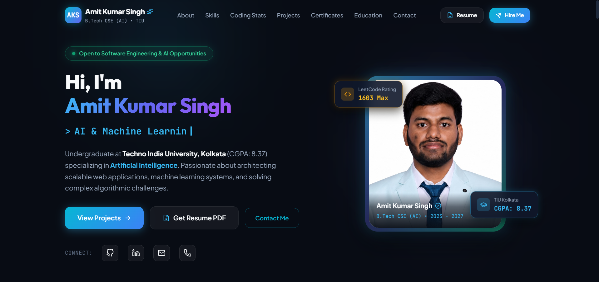

# 👨‍💻 Amit Kumar Singh — Portfolio

> A modern, responsive developer portfolio showcasing my skills, projects, experience, and journey as a Software Engineer & AI Developer.

[](https://portfolio-seven-nu-tg0pyf71zz.vercel.app/)
[](https://github.com/amitx22)

---

## 🚀 About The Project

This repository contains my personal developer portfolio website.

The portfolio is designed to provide a clean and professional overview of my:

* 💻 Software development skills
* 🤖 AI & development interests
* 🚀 Projects and practical work
* 🧑‍💻 Technical experience
* 📚 Learning journey
* 📬 Contact information

The website is fully responsive and optimized for a smooth experience across desktop and mobile devices.

---

## ✨ Features

* 🎨 Modern and clean UI
* 📱 Fully responsive design
* ⚡ Fast performance with Vite
* ⚛️ Built with React
* 🧩 Component-based architecture
* 💼 Projects showcase
* 🛠️ Skills & technologies section
* 👨‍💻 Developer profile section
* 📬 Contact section
* 🌐 Deployed on Vercel

---

## 🛠️ Tech Stack

### Frontend

* **React.js**
* **JavaScript**
* **HTML5**
* **CSS3**
* **Vite**

### Development Tools

* **Git**
* **GitHub**
* **VS Code**
* **Vercel**

---

## 📂 Project Structure

```text
portfolio/
│
├── public/
│   └── assets/
│
├── src/
│   ├── components/
│   ├── assets/
│   ├── App.jsx
│   ├── main.jsx
│   └── ...
│
├── .gitignore
├── index.html
├── package.json
├── package-lock.json
├── vite.config.js
└── README.md
```

---

## ⚙️ Getting Started

Follow these steps to run the portfolio locally.

### 1. Clone the repository

```bash
git clone https://github.com/amitx22/portfolio.git
```

### 2. Navigate to the project

```bash
cd portfolio
```

### 3. Install dependencies

```bash
npm install
```

### 4. Start the development server

```bash
npm run dev
```

The application will be available at:

```text
http://localhost:5173
```

---

## 📦 Build For Production

To create a production build:

```bash
npm run build
```

To preview the production build locally:

```bash
npm run preview
```

---

## 🌐 Live Demo

🚀 **Check out the live portfolio:**

**https://portfolio-seven-nu-tg0pyf71zz.vercel.app/**

---

## 📸 Portfolio Preview

 <p align="center">
  <a href="https://portfolio-seven-nu-tg0pyf71zz.vercel.app/" target="_blank">
    
  </a>
</p>

---

## 🎯 Goals

The main goals of this project are to:

* Build a strong developer presence online
* Showcase my projects and technical skills
* Practice modern frontend development
* Continuously improve UI/UX and performance
* Document my growth as a developer

---

## 🔮 Future Improvements

* [ ] Add more projects
* [ ] Add detailed project case studies
* [ ] Improve animations and interactions
* [ ] Add blog section
* [ ] Add downloadable resume
* [ ] Improve accessibility
* [ ] Add more performance optimizations

---

## 🤝 Connect With Me

I'm always open to connecting, collaborating, and learning from other developers.

**GitHub:**
https://github.com/amitx22

**Portfolio:**
https://portfolio-seven-nu-tg0pyf71zz.vercel.app/

---

## ⭐ Show Your Support

If you like this portfolio, consider giving the repository a ⭐ on GitHub.

---

### 💙 Built with React + Vite

**Amit Kumar Singh**
